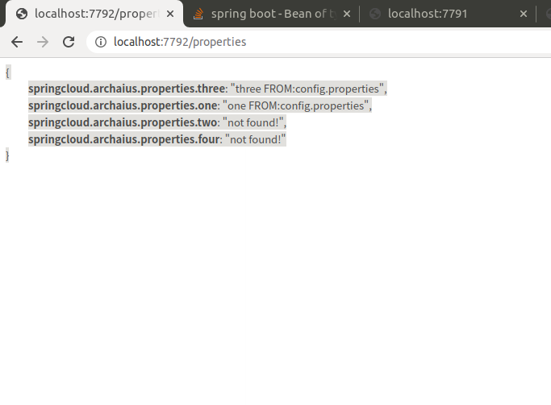

## turbine.stream 聚合 hystrix 请求融断  相关统计

## 一. pom 相关文件
## 引入包注意事项
 	springcloud 跟springboot 版本兼容 有个映射关系
   
1.引入hystrix 依赖 

  <dependency>
    <groupId>org.springframework.cloud</groupId>
   <artifactId>spring-cloud-starter-netflix-hystrix</artifactId>
</dependency>
        
2.引入dashboard
<dependency>
            <groupId>org.springframework.cloud</groupId>
<artifactId>spring-cloud-starter-netflix-hystrix-dashboard</artifactId>
        </dependency>
        
3.eureka client 
<dependency>
			<groupId>org.springframework.cloud</groupId>
			<artifactId>spring-cloud-starter-netflix-eureka-client</artifactId>
		</dependency>
		
		
4.springboot 监控引入
<dependency>
		   <groupId>org.springframework.boot</groupId>
		   <artifactId>spring-boot-starter-actuator</artifactId>
		</dependency>
		
5.  netflix-archaius 引入
		<dependency>
		    <groupId>org.springframework.cloud</groupId>
		    <artifactId>spring-cloud-starter-netflix-archaius</artifactId>
		</dependency>
		
## 配置 
1.配置 加在文件 ApplicationPropertiesConfigurations // classpath:config.properties
2.提供rest 配置获取接口  ConfigPropertiesController

## 返回结果
   

返回结果如下:  

{
springcloud.archaius.properties.three: "three FROM:config.properties",
springcloud.archaius.properties.one: "one FROM:config.properties",
springcloud.archaius.properties.two: "not found!",
springcloud.archaius.properties.four: "not found!"
}
