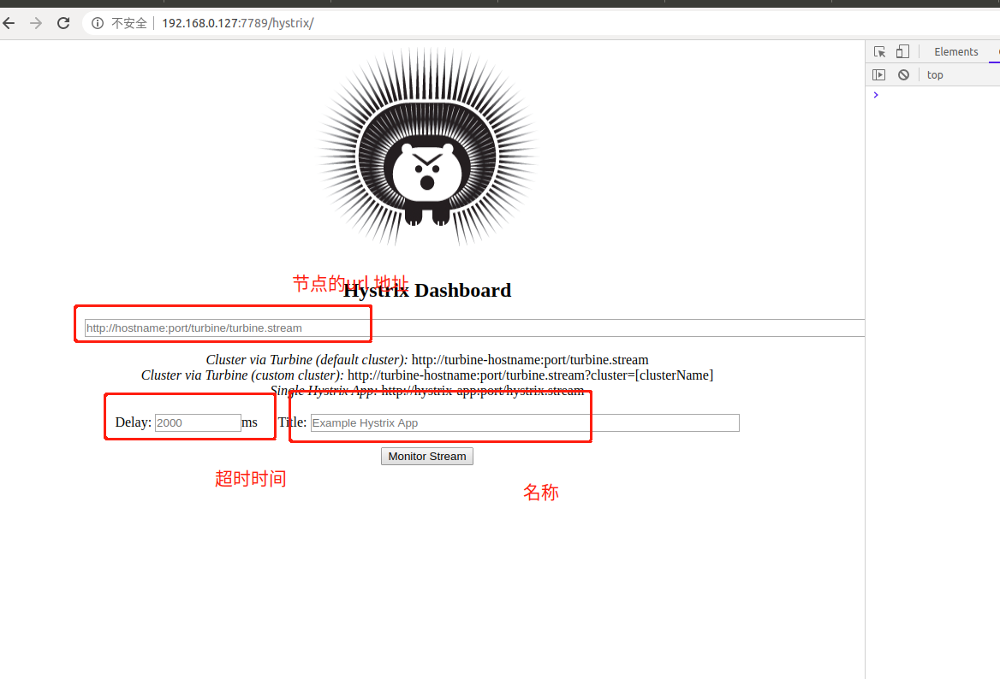
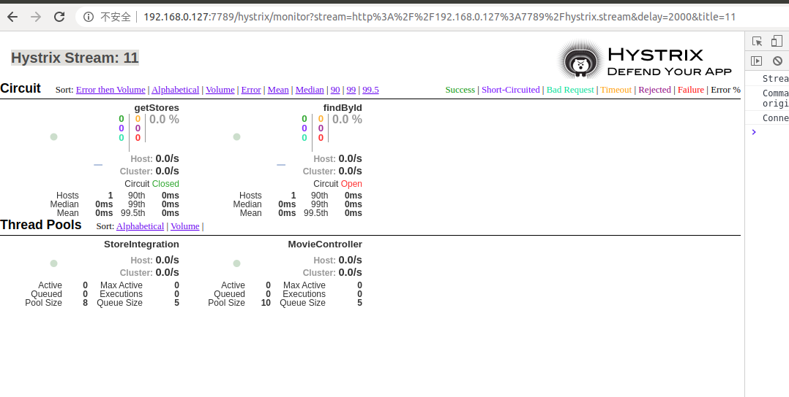

## 一. pom 相关文件
## 引入包注意事项
 	springcloud 跟springboot 版本兼容 有个映射关系
   
1.引入hystrix 依赖 

  <dependency>
    <groupId>org.springframework.cloud</groupId>
   <artifactId>spring-cloud-starter-netflix-hystrix</artifactId>
</dependency>
        
2.引入dashboard
<dependency>
            <groupId>org.springframework.cloud</groupId>
<artifactId>spring-cloud-starter-netflix-hystrix-dashboard</artifactId>
        </dependency>
        
3.eureka client 
<dependency>
			<groupId>org.springframework.cloud</groupId>
			<artifactId>spring-cloud-starter-netflix-eureka-client</artifactId>
		</dependency>
		
		
4.springboot 监控引入
<dependency>
		   <groupId>org.springframework.boot</groupId>
		   <artifactId>spring-boot-starter-actuator</artifactId>
		</dependency>
		
5.spring mvc

<dependency>
			<groupId>org.springframework.boot</groupId>
			<artifactId>spring-boot-starter-web</artifactId>
		</dependency>
		
		
## 二.@HystrixCommand 用于配置 融断后业务逻辑以及返回结果
1.fallbackMethod 触发融断跳转  业务逻辑
2.ServletRegistrationConfig 配置 hystrix.stream 相关业务

## 三.查看监控结果
1.访问 http://192.168.0.127:7789/hystrix/
 
2.添加 数据来源于 有 HystrixCommand注解方法
 

