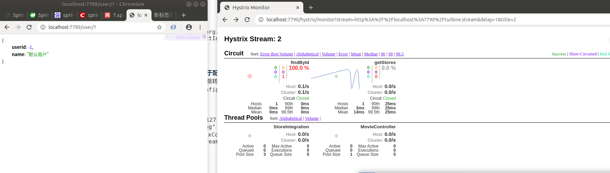

## turbine.stream 聚合 hystrix 请求融断  相关统计

## 一. pom 相关文件
## 引入包注意事项
 	springcloud 跟springboot 版本兼容 有个映射关系
   
1.引入hystrix 依赖 

  <dependency>
    <groupId>org.springframework.cloud</groupId>
   <artifactId>spring-cloud-starter-netflix-hystrix</artifactId>
</dependency>
        
2.引入dashboard
<dependency>
            <groupId>org.springframework.cloud</groupId>
<artifactId>spring-cloud-starter-netflix-hystrix-dashboard</artifactId>
        </dependency>
        
3.eureka client 
<dependency>
			<groupId>org.springframework.cloud</groupId>
			<artifactId>spring-cloud-starter-netflix-eureka-client</artifactId>
		</dependency>
		
		
4.springboot 监控引入
<dependency>
		   <groupId>org.springframework.boot</groupId>
		   <artifactId>spring-boot-starter-actuator</artifactId>
		</dependency>
		
5.trubine相应依赖
		<dependency>
			  <groupId>org.springframework.cloud</groupId>
  				<artifactId>spring-cloud-starter-netflix-turbine</artifactId>
		
		</dependency>
		
## 配置 
1.启用Turbine  @EnableTurbine
2.启用@EnableDiscoveryClient 客户端
3.启用dashboard @EnableHystrixDashboard
## 二.查看监控结果   聚合所有节点的监控 
1.访问 http://192.168.0.127:7789/hystrix/  
 

