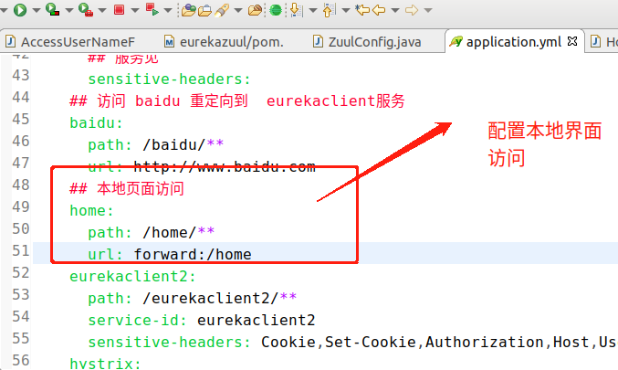
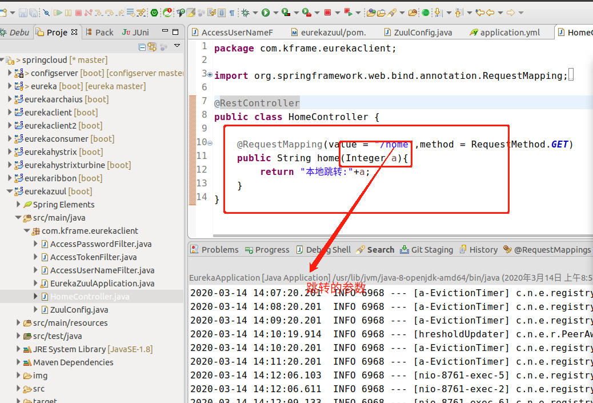
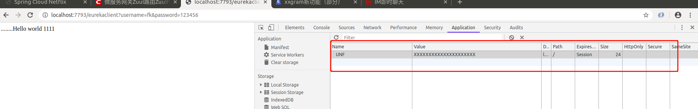

# 
ZUUL 网关配置

## 一. pom 相关文件
###  引入包注意事项
 	springcloud 跟springboot 版本兼容 有个映射关系
   

1.引入 eureka client

	<dependency>
			<groupId>org.springframework.cloud</groupId>
			<artifactId>spring-cloud-starter-netflix-eureka-client</artifactId>
	</dependency>

2.引入 netflix-zuul

	<dependency>
	        <groupId>org.springframework.cloud</groupId>
	        <artifactId>spring-cloud-starter-netflix-zuul</artifactId>
	</dependency>
   		
3.引入监控
	
	<dependency>
		   <groupId>org.springframework.boot</groupId>
		   <artifactId>spring-boot-starter-actuator</artifactId>
	</dependency>	

		
## 二. 配置说明
### 添加ZuulFilter 拦截器
 1.用户  密码登录 
 a. AccessPasswordFilter extends ZuulFilter  密码
 b. AccessUserNameFilter extends ZuulFilter  用户
 2.配置拦截实体对象
 ZuulConfig  创建 zuulFilter 对象
 
 3. ZuulFilter 实现方法抽象方法说明
 
  {
  
  
    /**
     * a "true" return from this method means that the run() method should be invoked
     *
     * @return true if the run() method should be invoked. false will not invoke the run() method
     */
    boolean shouldFilter();

    /**
     * if shouldFilter() is true, this method will be invoked. this method is the core method of a ZuulFilter
     *
     * @return Some arbitrary artifact may be returned. Current implementation ignores it.
	 * @throws ZuulException if an error occurs during execution.
     */
     
     
    Object run() throws ZuulException;
    
    /**
     * to classify a filter by type. Standard types in Zuul are "pre" for pre-routing filtering,
     * "route" for routing to an origin, "post" for post-routing filters, "error" for error handling.
     * We also support a "static" type for static responses see  StaticResponseFilter.
     * Any filterType made be created or added and run by calling FilterProcessor.runFilters(type)
     *
     * @return A String representing that type
     */
    abstract public String filterType();

    /**
     * filterOrder() must also be defined for a filter. Filters may have the same  filterOrder if precedence is not
     * important for a filter. filterOrders do not need to be sequential.
     *
     * @return the int order of a filter
     */
     
    abstract public int filterOrder();

    /**
     * By default ZuulFilters are static; they don't carry state. This may be overridden by overriding the isStaticFilter() property to false
     *
     * @return true by default
     */
    public boolean isStaticFilter() {
        return true;
    }
 }
 
4.敏感头不暴露给其他服务节点配置

 	
 	zuul:
  routes:
    eurekaclient: 
      path: /eurekaclient/**
      service-id: eurekaclient
      ## 敏感头配置 即黑名单头
      sensitive-headers: 不想暴露给下游服务的服务头名称 UNF , 以逗号分隔
      
5. 重定向配置

#### 1 .添加重定向返回信息

@RestController
public class HomeController {

    @RequestMapping(value = "/home",method = RequestMethod.GET)
    public String home(Integer a){
        return "本地跳转:"+a;
    }
}

 

#### 2 .添加重定向配置
zuul:
  routes:
    ## 本地页面访问
    home:
      path: /home/**
      url: forward:/home

 

#### 3. 返回结果
 返回结果
 
  
	
	

5.监控包下面服务暴露

management:
  endpoint:
    health:
      show-details: always 
  endpoints:
    web:
      exposure:
      ## 暴露actuator 监控包服务下的  所有http 接口
        include: "*" 
     
## 三.返回Cookie 对象

	ctx.getResponse().addCookie(new Cookie("UNF", "XXXXXXXXXXXXXXXXXXXXX")); //唯一登录标志
	
 	

## 四. EnableZuulServer VS  EnableZuulProxy

   Zuul为我们提供了两个主应用注解: @EnableZuulServer和@EnableZuulProxy，其中@EnableZuulProxy包含@EnableZuulServer的功能，而且还加入了@EnableCircuitBreaker和@EnableDiscoveryClient。当我们需要运行一个没有代理功能的Zuul服务，或者有选择的开关部分代理功能时，那么需要使用 @EnableZuulServer 替代 @EnableZuulProxy。 这时候我们可以添加任何 ZuulFilter类型实体类都会被自动加载，这和上一篇使用@EnableZuulProxy是一样，但不会自动加载任何代理过滤器。

##### 1 @EnableZuulServer默认过滤器
当我们使用@EnableZuulServer时，默认所加载的过滤器有：

1.1  PRE类型过滤器

ServletDetectionFilter
该过滤器是最先被执行的。其主要用来检查当前请求是通过Spring的DispatcherServlet处理运行的，还是通过ZuulServlet来处理运行的。判断结果会保存在isDispatcherServletRequest中，值类型为布尔型。

FormBodyWrapperFilter
该过滤器的目的是将符合要求的请求体包装成FormBodyRequestWrapper对象，以供后续处理使用。

DebugFilter
PRE类型过滤器。当请求参数中设置了debug参数时，该过滤器会将当前请求上下文中的RequestContext.setDebugRouting()和RequestContext.setDebugRequest()设置为true，这样后续的过滤器可以根据这两个参数信息定义一些debug信息，当生产环境出现问题时，我们就可以通过增加该参数让后台打印出debug信息，以帮助我们进行问题分析。对于请求中的debug参数的名称，我们可以通过zuul.debug.parameter进行自定义。

1.2 ROUTE类型过滤器

SendForwardFilter
该过滤器只对请求上下文中存在forward.to(FilterConstants.FORWARD_TO_KEY)参数的请求进行处理。即处理之前我们路由规则中forward的本地跳转。

1.3 POST类型过滤器

SendResponseFilter
该过滤器就是对代理请求所返回的响应进行封装，然后作为本次请求的相应发送回给请求者。

1.4 Error类型过滤器

SendErrorFilter
该过滤器就是判断当前请求上下文中是否有异常信息(RequestContext.getThrowable()不为空)，如果有则默认转发到/error页面，我们也可以通过设置error.path来自定义错误页面。

 

##### 2 @EnableZuulProxy默认过滤器
@EnableZuulProxy则在上面的基础上增加以下过滤器：

2.1 PRE类型过滤器

PreDecorationFilter
该过滤器根据提供的RouteLocator确定路由到的地址，以及怎样去路由。该路由器也可为后端请求设置各种代理相关的header。

2.2 ROUTE类型过滤器

RibbonRoutingFilter
该过滤器会针对上下文中存在serviceId(可以通过RequestContext.getCurrentContext().get(“serviceId”)获取)的请求进行处理，使用Ribbon、Hystrix和可插拔的HTTP客户端发送请求，并将服务实例的请求结果返回。也就是之前所说的只有当我们使用serviceId配置路由规则时Ribbon和Hystrix方才生效。

SimpleHostRoutingFilter
该过滤器检测到routeHost参数(可通过RequestContext.getRouteHost()获取)设置时，就会通过Apache HttpClient向指定的URL发送请求。此时，请求不会使用Hystrix命令进行包装，所以这类请求也就没有线程隔离和断路器保护。
